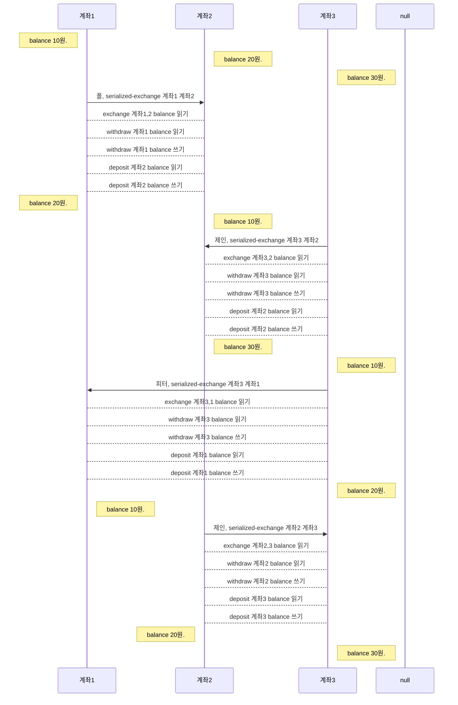
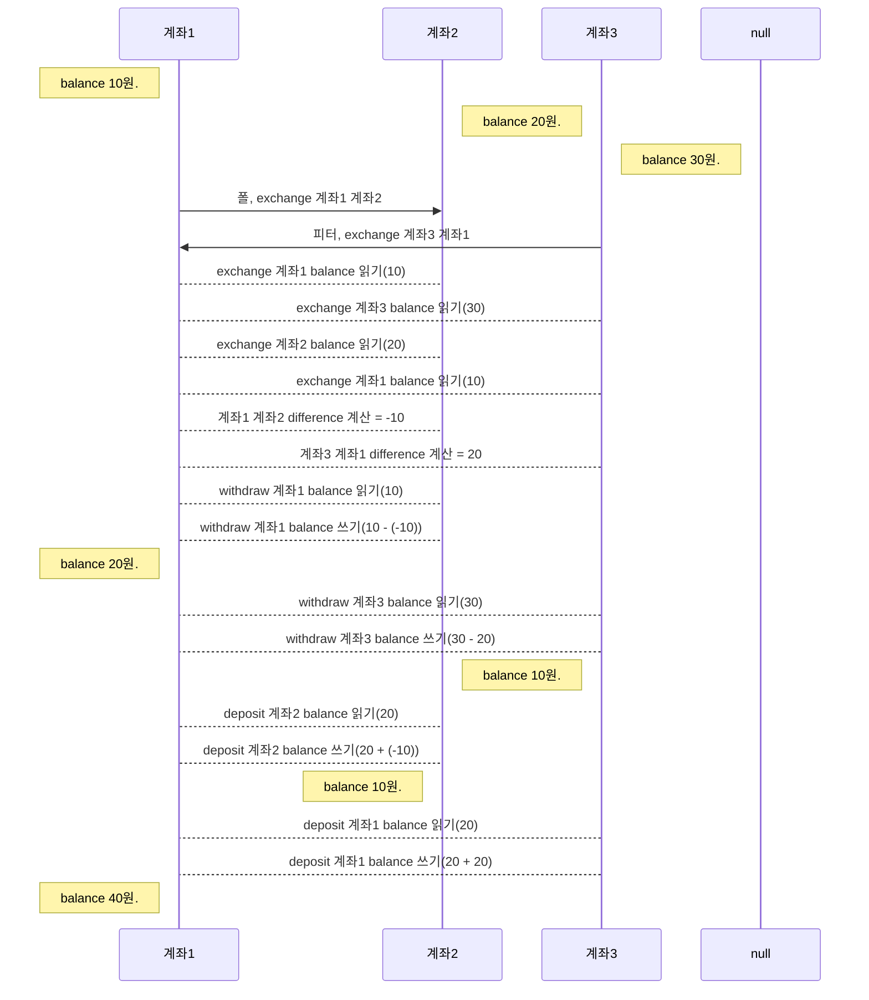
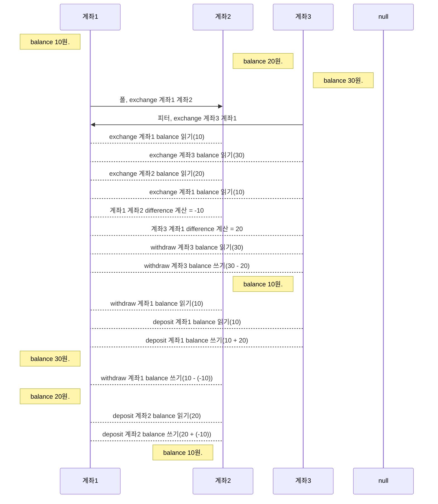
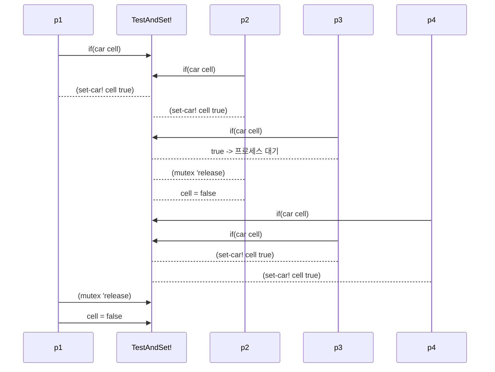

## 3.4 병행성: 시간은 중요하다.


 + 상태가 있는 객체로 프로그래밍하게 되면, 시간 개념이 프로그래밍의 핵심개념이 된다.

 + 현실세계에서 물체의 상태변화는 하나씩 일어나는 것이 아니라 병행하여 일어난다.

 + 그러므로 현실세계를 제대로 흉내내려면 병행 프로세스를 프로그래밍해야 한다.

 + 병행 처리가 순차 처리 보다 처리 속도를 높일 수도 있다.

 + 하지만 덮어쓰기와 시간개념 도입으로 생겨난 문제점이 병행성과 맞물리면 더 복잡해 진다.


### 3.4.1. 병행 시스템에서의 시간의 성질(본질)

* 그림 3.29는 lost update 예제

```lisp
(define balance 100)

(define (withdraw amount)
  (if (>= balance amount)  ;;balance를 읽는다.
      (begin (set! balance (- balance amount)) ;;balance를 계산한다. 그리고 덮어쓴다.
             balance)
      "Insufficient funds"))
```

잔고를 읽고, 계산하고, 덮어쓴다.
동시 수행할 경우, 다른 프로세스의 작업 현황이 반영이 안되면 잘못된 값을 덮어 쓰게 된다.
이것을 막으려면 한 프로세스가 작업할 때 다른 프로세스의 작업을 임시로 차단해야 한다.


####병행 프로그램의 올바른 동작

+ 병행시스템에서 상태 변화가 제대로 처리되는 것을 보장하는 방법 3가지 유형

  1. 상태변수 하나를 같이 쓰는 연산 두 개가 같은 시간에 돌아가지 않게 하는 방법

  2. 병행시스템이 여러 프로세스를 순차 처리한 것과 같은 결과를 만들어 내게 보장하는 방법
   이때, 결과만 같으면 되고, 그 결과는 여러 개일 수 있다.
   즉, 병행 프로그램은 본래 비결정적이다.
   (이번 챕터의 주된 내용이다.)

  3. 모든 프로세스가 이웃 값의 변화에 반응하여 자기 값을 스스로 고치게 하는 방법
   연산 처리 순서와 관계가 어떻든 올바른 결과로 이어진다.(이번 챕터에서 나오지 않는다.)

#####연습문제 3.38
    balance: 100
    Peter: (set! balance (+ balance 10))
    Paul : (set! balance (- balance 20))
    Mary : (set! balance (- balance (/ balance 2)))

######a. 프로세스가 차례대로 돌아갈 때 가능한 결과 값을 모두 적어라.
  + 최종결과 집합: (35, 40, 45, 50)
        Peter -> Paul -> Mary : 45
        Peter -> Mary -> Paul : 35
        Paul  -> Mary -> Peter: 50
        Paul  -> Peter-> Mary : 45
        Mary  -> Peter-> Paul : 40
        Mary  -> Paul -> Peter: 40

######b. 3개 프로세스의 덮어쓰기 연산 중 1~2 개 이상의 lost update가 발생될 수 있다.
    연산이 읽기, 계산하기, 덮어쓰기의 3단계로 진행될 때, 
    다른 연산의 진행을 알지 못하고 
    값을 읽는 순간부터 다른 연산의 계산결과가 반영되지 못하는 문제가 생긴다.


###3.4.2  병행성을 다스리는 방법
 + serializer 소개.(데이터 교환을 위한 직렬화serialization과 다르다.)

####한 상태를 여럿이 같이 쓸 때 그 차례를 정하는 방법
* 프로시저들을 여러 그룹으로 나누고, 같은 그룹 소속이면 동시 실행되지 못하게 막는다.
        한 변수의 값을 변경하는 여러 개의 프로시저가 있으면
        그 프로시저 내부의 읽기, 계산하기, 덮어쓰기 3종 연산을 하나의 프로시저로 묶고
        같은 타입의 프로시저들을 동일 그룹으로 분류하면
        하나의 프로시저가 수행될 때, 다른 프로시저가 변수값을 변경 못하게 보장할 수 있다.

####Scheme으로 serializer를 만드는 방법
```lisp
(parallel-execute p1 p2 p3 ... pk)
```
process1~k 마다 프로세스를 하나씩 따로 만들어서 process를 모두 병행하여 수행한다.

```lisp
(define x 10)
(parallel-execute (lambda () (set! x (* x x)))
                  (lambda () (set! x (+ x 1))))
```

 + set! 연산은 x의 값을 읽고, 계산을 수행하고, 그 결과를 x에 덮어쓴다.
 + 3단계 연산과 2개의 프로시저가 뒤섞이는 방식에 따라 5가지 결과가 나온다.
   - 정상결과는 101, 121
   - lost update는 11, 100
   - 동일 프로세스에서 2회 이상의 동일 변수 읽기 도중 
     타 프로세스 연산에 의해 변수의 값이 변경된 경우 나올 수 있는 110

```lisp
(define g 10)
(define s (make-serializer))
(parallel-execute (s (lambda () (set! g (* g g))))
                  (s (lambda () (set! g (+ g 1)))))
```

 + 동일한 serializer가 적용된 프로세스는 같은 그룹으로 분류되어 병행처리되지 못한다. 
 + 고로 정상결과인 101, 121만 나올 수 있다.
 + 돈 넣고, 돈 찾는 프로시저에 serializer 적용하기.

```lisp
(define (make-account balance)
  (define (withdraw amount)
    (if (>= balance amount)
        (begin (set! balance (- balance amount))
               balance)
        "Insufficient funds"))
  (define (deposit amount)
    (set! balance (+ balance amount))
    balance)
  (let ((protected (make-serializer)))
    (define (dispatch m)
      (cond ((eq? m 'withdraw) (protected withdraw))
            ((eq? m 'deposit) (protected deposit))
            ((eq? m 'balance) balance)
            (else (error "Unknown request -- MAKE-ACCOUNT"
                         m))))
    dispatch))
```
   - 이제, 돈 넣고, 돈 찾는 프로시저는 병행처리가 안된다.
   - 이것은 하나의 계정 마다 적용되므로, 다른 계정들 간에는 병행처리가 정상 작동한다.

#####연습문제 3.39
```lisp
(define v 10)
(define s1 (make-serialization))
(parallel-execute (lambda () (set! v ((s1 (lambda () (* v v))))))
                  (s1 (lambda () (set! v (+ v 1)))))
```

 + parallel-execute의 첫번째 프로시저와 두번째 프로시저가 있다.
   - 첫번째는 읽기+계산 연산과 덮어쓰기 연산이 분리된다.
   - 두번째는 읽기+계산+덮어쓰기 연산이 하나로 묶여 있다.
   - 나올 수 있는 경우의 수는 아래 3가지다.

```mermaid

sequenceDiagram

  participant p1

  participant v

  participant p2

  participant null

  Note right of p2:경우의 수1

  p1->>v: (*v v)

  p2->>v: (set! v (+ v 1))

  Note right of v: 11

  p1->>v: (set! v)

  Note right of p1: 100

  p1-null:


  Note right of p2:경우의 수2

  p2->>v: (set! v (+ v 1))

  Note right of v: 11

  p1->>v: (*v v)

  p1->>v: (set! v)

  Note right of p1: 121

  p1-null:


  Note right of p2:경우의 수3

  p1->>v: (*v v)

  p1->>v: (set! v)

  Note right of p1: 100

  p2->>v: (set! v (+ v 1))

  Note right of v: 101

```

#####연습문제 3.40

```lisp
(define k 10)
(parallel-execute (lambda () (set! k (* k k)))
                  (lambda () (set! k (+ k k k))))
```

 + 정상: 130, 900
 + lost-update: 100, 30
 + 동일 변수의 값 읽기가 동일 프로세스 내에서 2회 이상 다른 시점에 수행되는 경우의 수가 많아졌다.
        프로세스 별로  x1, x2 / x3, x4, x5로 표시하여 살펴 보자.
        x1 -> x3 -> x2 -> x4 -> * -> x5 -> + = 120
        x1 -> x2 -> x3 -> * -> x4 -> x5 -> + = 210
        x1 -> x3 -> x4 -> x5 -> + -> x2 -> * = 300
 + serializer 적용시키면 정상값만 나올 것.

#####연습문제 3.41
계정에서 balance만 조회하는 연산도 아래처럼 줄세우개를 적용해야 하는가? 
```lisp
(define (make-account balance)
  (define (withdraw amount)
    (if (>= balance amount)
        (begin (set! balance (- balance amount))
                balance)
        "Insufficinet funds"))
  (define (deposit amount)
    (set! balance (+ balance amount))
    balance)
  (let ((protected (make-serializer)
    (define (dispatch m)
       (cond ((eq? m 'withdraw) (protected withdraw))
             ((eq? m 'deposit) (protected deposit))
             ((eq? m 'balance) 
                ((protected (lambda () balance)))) ; serialized
             (else (error "Unknown request -- MAKE-ACCOUNT" m))))
    dispatch))
```
balance 값을 읽기만 하면 병행처리에 문제가 없다.
문제는 계산을 위해 balance값을 읽고 balance값을 변경하는 경우다.
문제가 일어날 만한 연산은 결국 withdraw와 deposit인데 이들은 줄세우개가 적용된다.
그러므로 balance만 조회할 때는 굳이 줄세우개를 쓰지 않아도 될 것이다.

#####연습문제 3.42
withdraw와 deposit을 계속 새로 만들지 말고, 미리 만들어 두고 재활용하면 아래와 같다.
```lisp
(define (make-account balance)
  (define (withdraw amount)
    (if (>= balance amount)
        (begin (set! balance (- balance amount))
                balance)
        "Insufficinet funds"))
  (define (deposit amount)
    (set! balance (+ balance amount))
    balance)
  (let ((protected (make-serializer)
    (let ((protected-withdraw (protected withdraw))
         ((protected-deposit (protected deposit)))
      (define (dispatch m)
        (cond ((eq? m 'withdraw) protected-withdraw)
              ((eq? m 'deposit) protected-deposit)
              ((eq? m 'balance) balance)
              (else (error "Unknown request -- MAKE-ACCOUNT" m))))
      dispatch)))
```

######문제가 있나?
일단 구문 자체는 정상 작동한다. 그리고 기능도 잘 작동한다.

######구버전 make-account와 병행성에 어떤 차이가 있나?
구버전은 프로세스를 새로 만들고 신버전은 기존 프로세스를 재활용한다.
기존 프로세스 재활용은 기존 프로세스를 순서대로 반복 사용하는 것일뿐 더 이상 병행처리는 아니다.
즉, 병행성은 독립된 별개의 프로세스 사이에서 이루어지는 것이다.


####여러 자원을 함께 쓰는 문제
 + 자원 하나를 여럿이 쓰는 경우는 serializer로 해결이 되었다.
 + 여러 자원을 함께 쓰는 경우는 어떨지 두 은행계정의 남은 돈을 맞바꾸는 작업을 보자.

```lisp
(define (exchange account1 account2)
  (let ((difference (- (account1 'balance)
                       (account2 'balance))))
    ((account1 'withdraw) difference)
    ((account2 'deposit) difference)))
```

  - 두 계정의 차이값을 계산해서 그 값만큼 한쪽에서 돈을 찾고 다른쪽에 넣어준다.
    차이값이 음수면 돈을 찾고 넣어주는 역할이 자연스럽게 반대가 된다.

 + 피터가 a1계정에서 a2계정으로 이체할 때, 폴이 a1계정에서 a3계정으로 이체할 경우
   잘못된 결과가 나올 수 있다.(연습문제 3.43에서 보게 된다.)
 + 문제를 해결하려면 피터가 a1계정을 exchange 프로시저로 작업할 때 
   폴이 exchange 프로시저로 a1계정을 건드리지 못하게 막아야 한다.

 + 두 계정의 내부 serializer로 exchange 프로시저를 줄 세운 프로시저로 만드는 방법이 있다.
```lisp
(define (make-account-and-serializer balance)
  (define (withdraw amount)
    (if (>= balance amount)
        (begin (set! balance (- balance amount))
               balance)
        "Insufficient funds"))
  (define (deposit amount)
    (set! balance (+ balance amount))
    balance)
  (let ((balance-serializer (make-serializer)))
    (define (dispatch m)
      (cond ((eq? m 'withdraw) withdraw)
            ((eq? m 'deposit) deposit)
            ((eq? m 'balance) balance)
            ((eq? m 'serializer) balance-serializer)
            (else (error "Unknown request -- MAKE ACCOUNT" m))))
    dispatch))
```
   - 이렇게 만들면 계정을 쓰는 사람이 프로시저에 serializer 적용을 직접해야 한다.

```lisp
(define (deposit account amount)
  (let ((s (account 'serializer))
        (d (account 'deposit)))
    ((s d) amount)))
```

  - 해당 계정의 serializer와 deposit을 가져와 디파짓에 시리얼라이저를 적용하고 amount를 디파짓한다.
  - 두 계정의 serializer를 밖에서 꺼내어 exchange 프로시저에 적용하면 문제가 해결된다.
```lisp
(define (serialized-exchange account1 account2)
  (let ((serializer1 (account1 'serializer))
        (serializer2 (account2 'serializer)))
    ((serializer1 (serializer2 exchange))
     account1
     account2)))
```

  - 원본 익스체인지에 대한 일종의 래퍼 프로시저? 하지만 익스체인지를 외부에서 전달받지는 않는다.
  - exchange에 계정2 serializer를 적용하고 다시 계정1 serializer를 적용하는 게 신기하다.

#####연습문제 3.43
계좌 acc1: 10, acc2: 20, acc3: 30 잔액을 교환할 때
1) 병행으로 잔액 교환을 되풀이 해도 모든 프로세스가 차례대로 돌아가면 
   잔액도 차례대로 보존되어 들어 있다는 사실을 밝혀라.
2) 처음 만든 exchange로는 이게 안되는 이유를 설명하라.
3) 처음 만든 exchange로도 계정 잔액의 합계 만큼은 제대로 유지가 되는 것을 밝혀라.
4) 각 계정의 트랜잭션을 줄 세워 처리하지 않으면 이런 조건이 깨지는 이유를 설명하라.

###### 1) 병행처리에도 순차적으로 적용될 경우 잔액이 차례대로 놓여지는 것을 밝혀라.
```lisp
(define exch12 (serialized-exchange acc1 acc2))
(define exch13 (serialized-exchange acc1 acc3))
(define exch23 (serialized-exchange acc2 acc3))
(parallel-execute exch12 exch13 exch23)
```



###### 2) exchange 구버전으로 쓸 경우는 왜 그것이 보장이 안되는지 밝혀라.



###### 3) 위의 도표를 보면 exchange 구버전을 쓰더라도 계정 잔액의 합계는 신버전과 동일하다.
###### 4) 계정 내부 트랜잭션에 serializer 적용이 안되면 계정 잔액 합계 마저도 동일성이 상실된다.




#####연습문제 3.44
 + 계좌 잔액 교환이 아닌 일정액 이체 문제.
 + Ben Bitdiddle은 deposit, withdraw가 내부에서 serializer 적용된 계정만 있다면
   아래의 프로시저로도 다중 사용자의 병행 계좌 이체는 가능하다고 본다.

```lisp
(define (transfer from-account to-account amount)
  ((from-account 'withdraw) amount)
  ((to-account 'deposit) amount))
```
 + 하지만 Louis Reasoner는 이거말고 계좌 잔액교환에서 동원된 방법을 써야한다고 본다.

######누구 말이 맞는가? 이체와 교환에 어떤 차이가 있는가?
   - 계좌 잔액교환의 경우 difference를 계산할 때 balance를 읽고, withdraw와 deposit을 계산할 때도 
     balance를 읽는다. 따라서 특정 계좌 공유하는 둘 이상의 교환 프로시저가 병행될 경우를 막아야 한다.
   - 하지만 계좌이체는 병행으로 인하여 동일계좌의 balance를 잘못 파악할 위험이 없다.
     따라서 그냥 써도 된다.

#####연습문제 3.45
 + Louis Reasoner는 지금까지 만들어온 은행 계정 시스템이 serializer가 자동적용이 안되므로 오히려 복잡하고 오류발생이 쉽다고 본다. 그래서 내부에서 withdraw, deposit에 serializer 적용하고 외부에서도 serializer를 꺼내서 쓸 수 있게 하자고 제안한다. 제안 코드는 아래와 같다. 그러면 deposit도 간편해진다.

```lisp
(define (make-account-and-serializer balance)
  (define (withdraw amount)
    (if (>= balance amount)
        (begin (set! balance (- balance amount))
               balance)
        "Insufficient funds"))
  (define (deposit amount)
    (set! balance (+ balance amount))
    balance)
  (let ((balance-serializer (make-serializer)))
    (define (dispatch m)
      (cond ((eq? m 'withdraw) (balance-serializer withdraw))
            ((eq? m 'depost) (balance-serializer deposit))
            ((eq? m 'balance) balance)
            ((eq? m 'serializer) balance-serializer)
            (else (error "Unknown request -- MAKE-ACCOUNT" m))))
    dispatch))

;신버전 deposit
(define (deposit account amount)
  ((account 'deposit) amount))

;구버전 deposit
(define (deposit account amount)
  (let ((s (account 'serializer))
        (d (account 'deposit)))
    ((s d) amount)))

;문제풀이용 serialized-exchange 정의 참조
(define (serialized-exchange account1 account2)
  (let ((serializer1 (account1 'serializer))
        (serializer2 (account2 'serializer)))
    ((serializer1 (serializer2 exchange))
     account1
     account2)))
```

######Louis의 생각이 왜 틀렸나? serialized-exchange를 사용할 때 어떤 일이 일어나나?
 + 위의 정의를 적용하면 exchange, withdraw, deposit이 모두 동일한 balance-serializer가 적용된다.
   exchange는 내부에서 withdraw, deposit을 호출하는데 이들은 exchange가 끝나야 작업을 수행할 수 있다.
   결국 교착상태에 빠지게 될 것이다.

####줄 세우개 만들기
 + MUTEX(MUTual EXclusion)는 acquired, released 연산에 쓰이는데
   한 프로세스가 뮤텍스를 잡으면, 다른 프로세스는 뮤텍스가 풀릴 때까지 잡을 수 없다.
 + serializer는 뮤텍스를 한개만 갖는다.
 + serializer가 프로시저 p를 인자로 받으면, 뮤텍스를 쥔 별개의 프로시저 하나를 반환하는데
   그 프로시저가 프로시저 p를 실행한다. 
 + 별개의 프로시저는 프로시저 p 실행이 끝나면 뮤텍스를 풀어준다.
 + 이런 내용으로 serializer를 짜보면 아래와 같다.

```lisp
(define (make-serializer)
  (let ((mutex (make-mutex)))
    (lambda (p)
      (define (serialized-p . args)
        (mutex 'acquired)
        (let ((val (apply p args)))
          (mutex 'released)
          val))
      serialized-p)))
```
  - 뮤텍스는 참, 거짓이 들어 있는 cell이란 list를 가진다.
  - cell이 거짓이면 아무 프로세스나 뮤텍스를 쥘 수 있다.
  - cell이 참이면 거짓이 될 때까지 기다려야 한다.
  - 뮤텍스 constructor는 최초엔 cell값을 거짓으로 설정한다.
  - 외부에서 뮤텍스를 쥘려고 하면 cell값을 살펴서 거짓이면 cell값을 참으로 바꾸고
    하려던 일을 계속하면 된다.
  - 참이면 루프를 돌면서 cell값이 거짓이 되기를 기다린다.
  - 쥔 뮤텍스를 풀어줄 때는 cell값을 거짓으로 바꿔준다.

```lisp
(define (make-mutex)
  (let ((cell (list false)))
    (define (the-mutex m)
      (cond ((eq? m 'acquire)
             (if (test-and-set! cell)
                 (the-mutex 'acquire)))
            ((eq? m 'release) (clear! cell))))
    the-mutex))

(define (clear! cell)
  (set-car! cell false))

(define (test-and-set! cell)
  (if (car cell)
      true
      (begin (set-car! cell true)
             false)))
```
 + 병행처리를 위하여 mutex를 만드는데 뮤텍스 내부의 cell을 검사하고 값을 바꾸는 test-and-set! 단계에서도
   병행성 제어가 요구된다!
 + cell값을 읽고 덮어 쓰는 사이에 다른 프로세스가 cell값을 읽지 못하게 해야한다.
   그러려면 test-and-set!이 쪼개질 수 없는 원자처럼 통으로 처리되게 해야 한다.
 + 두 가지 방법이 있는데
   1. 병행처리가 시분할 방식인 경우 인터럽트가 걸리지 않게 만들기
   2. 하드웨어에서 지원되는 원자 연산 처리 명령 사용하기
   - MIT SCHEME은 아래처럼 1방식을 쓸 수 있다.

```lisp
(define (test-and-set! cell)
  (without-interrupts
   (lambda ()
     (if (car cell)
         true
         (begin (set-car! cell true)
                false)))))
```

#####연습문제 3.46
 + test-and-set!이 아톰 연산이 아닐 경우 
두 프로세스가 동시에 뮤텍스를 쥘 수 있으면 어떤 문제가 일어날지 시간흐름도를 그려라.


 + 뮤텍스가 재기능을 못해서 공유 상태를 동시에 사용하는 프로세스가 점점 증가할 수 있다.
   결국 공유 상태에 대한 잘못된 정보로 시스템이 엉망이 될 것이다.

#####연습문제 3.47
 + 세마포는 다수의 프로세스가 병행으로 쥘 수 있다.
 + 다만 세마포도 풀려야 다른 프로세스가 쥘 수 있다. 세마포를 만들어 보라.

######a. 뮤텍스로 세마포를 만드는 경우
착상) 세마포라는 객체 안에 수개의 뮤텍스를 배치하고 전체를 검사 및 조정하는 방법.

######b. 원자 연산 test-and-set!을 써서 세마포를 만드는 경우
착상) 뮤텍스의 cell의 원소 개수를 늘려주고 test-and-set!에서 검사 및 조정하는 방법.


####DEADLOCK
 + a1, a2 잔액 교환에서 폴이 a1과 a2를 바꾸려고 하고, 피터가 a2와 a1을 바꾸려 할 때
   폴의 교환 프로세스는 a1을 쥐고 a2에서 대기하고, 피터의 교환 프로세스는 a2를 쥐고, a1에서 대기하여
   결국 교착 상태에 빠져 버린다.
 + 해결법으로 계정마다 번호를 매겨 놓고 모든 프로세스가 낮은 번호부터 쥐고 시작하게 하는 방법이 있다.
 + 하지만 이 보다 더 복잡한 방식이 필요하거나 아예 교착상태를 피할 수 없는 경우도 있다.

#####연습문제 3.48
######계정마다 번호 매겨 놓고 모든 프로세스가 낮은 번호부터 쥐고 시작하게 하면 왜 교착상태를 피할 수 있나?
 + serialized-exchange를 이 방식으로 고쳐보라.(make-account를 번호 매기고 꺼내게 고쳐라)

```lisp
(define (make-wpn wpn)  ; WPN(Work Priority Number)
  (define (dispatch m)
    (if (eq? m 'increment) 
          (begin (set! wpn (+ wpn 1))
                 wpn)
          (error "Unknown request -- MAKE-WPN" m)))
  dispatch)

(define wpn-maker (make-wpn 0))

(define (make-account balance)
  (define (withdraw amount)
    (if (>= balance amount)
        (begin (set! balance (- balance amount))
                balance)
        "Insufficinet funds"))
  (define (deposit amount)
    (set! balance (+ balance amount))
    balance)

  (let ((wpn (wpn-maker 'increment)) ; set new wpn
        (protected (make-serializer)))
    (define (dispatch m)
       (cond ((eq? m 'withdraw) (protected withdraw))
             ((eq? m 'deposit) (protected deposit))
             ((eq? m 'balance) balance)
             ((eq? m 'wpn) wpn) ; get wpn
             (else (error "Unknown request -- MAKE-ACCOUNT" m))))
    dispatch))

(define (serialized-exchange account1 account2)
  (let ((serializer1 (account1 'serializer))
        (serializer2 (account2 'serializer)))
    (if (< (account1 'wpn) (account2 'wpn)) ; compare wpn
        ((serializer1 (serializer2 exchange)) account1 account2)
        ((serializer2 (serializer1 exchange)) account2 account1))))
```

#####연습문제 3.49
######번호 매김 방식도 교착상태에 빠지는 시나리오를 짜봐라.
 + blank


####병행성, 시간, 정보 주고받기communication
 + 병행처리는 항상 상태를 함께 쓰는 상황을 해결해야 한다.
 + 전역 flag 확인 방식은 대세인 캐시 메모리나 파이프라이닝 기법과 어울리지 않는다.
   이제는 serializer 방식이 대세다.
 + serialrizer도 barrier synchronization(설정된 경계지점에서 동기화 기법)이 있다.
 + 지점마다 별개로 돈을 관리하다가 일정 시간 간격으로 돈을 맞추어 보는 시스템이 있다.
   이런 분산 시스템이 올바로 돌아가는지 확인하는 방법은 
   1. 계좌를 공유하는 개개의 원거리 사용자 눈에 시스템이 어떻게 움직이는지 파악하고,
   2. 돈을 동기화한 뒤의 계정 상태가 어떤지만 따져보면 된다.

 + 다수 프로세스의 동기를 맞추고, 함께 쓰는 상태를 정하고, 순서를 정하는 데
   프로세스 사이에서 정보 주고받기가 필요하다.
